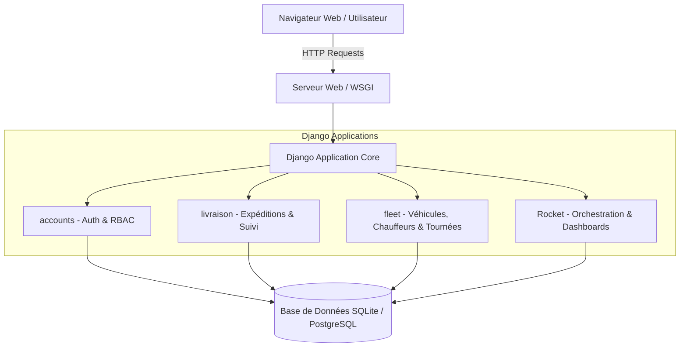

# 🚀 Rocket Transport Management System (TMS)

[](https://www.python.org/)
[](https://www.djangoproject.com/)
[](https://sqlite.org/)
[](https://developer.mozilla.org/)
[]()

> **Système intégré de gestion logistique, planification de tournées, supervision de flotte, suivi en temps réel et facturation automatisée avec contrôle d'accès basé sur les rôles (RBAC).**

---

## 📑 Sommaire

- [Présentation Générale](#-présentation-générale)
- [Fonctionnalités Principales](#-fonctionnalités-principales)
- [Matrice des Rôles & Permissions (RBAC)](#-matrice-des-rôles--permissions-rbac)
- [Architecture & Conception](#-architecture--conception)
- [Structure du Projet](#-structure-du-projet)
- [Guide d'Installation & Démarrage Rapide](#-guide-dinstallation--démarrage-rapide)
- [Configuration de l'Environnement](#-configuration-de-lenvironnement)
- [Déploiement & Sécurité](#-déploiement--sécurité)
- [Licence](#-licence)

---

## 🌟 Présentation Générale

**Rocket Transport Management System** est une solution web moderne conçue pour optimiser et centraliser l'ensemble de la chaîne de valeur du transport de marchandises. Du dépôt d'une demande d'expédition par un client jusqu'à la livraison finale et la réconciliation financière, la plateforme orchestre les flux physiques, informationnels et financiers avec un haut niveau de traçabilité.

### Points Clés
- **Contrôle d'accès granulaire (RBAC)** : interfaces et privilèges adaptés selon le profil utilisateur (Administrateur, Client, Chauffeur).
- **Tarification automatique et transparente** : calcul dynamique des frais d'expédition (poids, volume, destination forfaitaire ou zonale).
- **Gestion intelligente de la flotte** : suivi des véhicules, affectation des chauffeurs, gestion du carburant et maintenance.
- **Cycle complet de facturation** : facturation groupée, application automatique de la TVA (19%), et gestion du solde client.

---

## ⚡ Fonctionnalités Principales

### 1. 📊 Tableau de Bord Décisionnel (`/dashboard/`)
- Vue d'ensemble adaptée en temps réel selon le rôle de l'utilisateur connecté.
- Indicateurs clés de performance (KPIs) : chiffre d'affaires, volume d'expéditions en cours, taux de ponctualité, réclamations actives.
- Visualisations statistiques et évolution mensuelle de l'activité.

### 2. 📦 Module Expéditions (`/expedition/`)
- Saisie intuitive d'expéditions multi-critères (poids, volume, expéditeur, destinataire, type de service).
- Moteur de calcul tarifaire automatisé (formule paramétrable par zone et type de service).
- Journalisation de chaque changement d'état (En attente, Assignée, En cours, Livrée, Annulée).

### 3. 🔍 Traçabilité & Suivi en Direct (`/tracking/<id>/`)
- Historique d'acheminement pas-à-pas pour chaque colis.
- Ajout d'étapes de contrôle logistique avec horodatage et localisation.
- Consultation publique et sécurisée du statut d'expédition.

### 4. 🚚 Gestion de Flotte & Chauffeurs (`/fleet/`)
- Inventaire exhaustif du parc de véhicules (statut, immatriculation, capacité de charge, disponibilité).
- Fiches détaillées des chauffeurs (permis, disponibilité, historique de conduite).
- Suivi du kilométrage, consommation moyenne de carburant et alertes d'entretien.

### 5. 🗺️ Planification des Tournées (`/tournees/`)
- Regroupement des expéditions par zone géographique et itinéraire optimal.
- Assignation directe au binôme véhicule-chauffeur.
- Mise à jour en temps réel de la progression de la tournée sur le terrain.

### 6. 🧾 Facturation & Règlements (`/facturation/`)
- Génération automatisée de factures avec calcul de la TVA légale (19%).
- Consolidation des expéditions par période et par client.
- Gestion des paiements échelonnés/partiels et mise à jour en temps réel des créances clients.

### 7. ⚠️ Gestion des Incidents (`/incidents/`)
- Déclaration immédiate des anomalies routières ou logistiques (retard, panne, avarie de colis).
- Upload de preuves numériques (photos, bons de livraison annotés).
- Classification par degré de gravité et déclenchement d'actions correctives.

### 8. 💬 Service Client & Réclamations (`/reclamation/`)
- Enregistrement de réclamations directement depuis l'espace client.
- Attribution des tickets aux gestionnaires de support avec statut de traitement.

---

## 👥 Matrice des Rôles & Permissions (RBAC)

| Fonctionnalité / Module | Administrateur (`ADMIN`) | Client (`CLIENT`) | Chauffeur (`CHAUFFEUR`) |
| :--- | :---: | :---: | :---: |
| **Accès au Dashboard Global** | ✅ Complet (Tous KPIs) | 🔹 Personnel (Ses commandes) | 🔹 Opérationnel (Ses tournées) |
| **Créer une expédition** | ✅ Oui | ✅ Oui | ❌ Non |
| **Consulter toutes les expéditions** | ✅ Toutes | 🔹 Ses propres expéditions | 🔹 Celles de sa tournée |
| **Facturation & Règlements** | ✅ Gestion complète | 🔹 Consultation de ses factures | ❌ Non |
| **Gestion du parc de véhicules** | ✅ CRUD complet | ❌ Non | 🔹 Consultation restreinte |
| **Planification des tournées** | ✅ Création & Assignation | ❌ Non | 🔹 Mise à jour statut / progression |
| **Déclaration d'incident** | ✅ Supervision | ❌ Non | ✅ Déclaration avec preuve |
| **Dépôt de réclamation** | ✅ Traitement & Résolution | ✅ Dépôt & Consultation | ❌ Non |
| **Administration Système (Django)** | ✅ Accès total (`/admin/`) | ❌ Non | ❌ Non |

---

## 🏗️ Architecture & Conception

Le système adopte le pattern standard **MVT (Model-View-Template)** de Django, garantissant une séparation stricte des responsabilités :



---

## 📁 Structure du Projet

```text
Rocket-TRANSPORT-MANAGEMENT-SYSTEM/
├── .env.example              # Gabarit des variables d'environnement
├── .gitignore                # Règles d'exclusion Git (sécurité, venv, pycache)
├── requirements.txt          # Dépendances Python du projet
├── README.md                 # Documentation officielle du projet
├── README.txt                # Note technique originale
├── E20_rapport.pdf           # Rapport d'analyse et de conception académique
│
└── projet_si/                # Dossier racine du projet Django
    ├── manage.py             # CLI Django d'administration et d'exécution
    │
    ├── projet_si/            # Configuration globale du projet
    │   ├── settings.py       # Configuration (BDD, apps, auth, variables .env)
    │   ├── urls.py           # Routeur principal d'URLs
    │   ├── wsgi.py           # Point d'entrée WSGI pour serveurs web
    │   └── asgi.py           # Point d'entrée ASGI pour requêtes asynchrones
    │
    ├── accounts/             # Application : Gestion Utilisateurs, Clients & Facturation
    │   ├── models.py         # Utilisateur (RBAC), Client, Facture, Paiement, Reclamation
    │   ├── views.py          # Logique d'authentification et gestion financière
    │   └── urls.py           # Routes du module accounts
    │
    ├── livraison/            # Application : Gestion Logistique & Expéditions
    │   ├── models.py         # Expedition, Destination, TypeService, SuiviExpedition
    │   ├── views.py          # Logique de création, calcul tarifaire et suivi
    │   └── urls.py           # Routes logistiques
    │
    ├── fleet/                # Application : Flotte, Chauffeurs & Tournées
    │   ├── models.py         # Chauffeur, Vehicule, Tournee, Incident
    │   ├── forms.py          # Formulaires de saisie et d'incidents
    │   ├── views.py          # Affectation des tournées et maintenance
    │   └── urls.py           # Routes du module flotte
    │
    ├── Rocket/               # Application : Dashboard & Vues Maîtresses
    │   ├── models.py         # Modèles transversaux
    │   ├── views.py          # Vues décisionnelles, statistiques et reporting
    │   └── urls.py           # Routes principales du portail
    │
    ├── templates/            # Gabarits HTML (moteur de templates Django)
    │   ├── base.html         # Layout maître responsive (navbar, sidebar, styles)
    │   └── Rocket/           # Templates spécifiques (dashboard, facturation, tournées...)
    │
    └── static/               # Feuilles de style CSS, scripts JavaScript, médias statiques
```

---

## 🚀 Guide d'Installation & Démarrage Rapide

### 1. Prérequis
- **Python** 3.10 ou supérieur installé ([python.org](https://www.python.org/))
- **Git** installé ([git-scm.com](https://git-scm.com/))
- **pip** (inclus avec Python)

---

### 2. Cloner le Projet

```bash
git clone https://github.com/1YounesAlloui/Rocket-TRANSPORT-MANAGEMENT-SYSTEM.git
cd Rocket-TRANSPORT-MANAGEMENT-SYSTEM
```

---

### 3. Créer et Activer l'Environnement Virtuel

- **Sur Windows (PowerShell / CMD) :**
  ```powershell
  python -m venv venv
  .\venv\Scripts\activate
  ```

- **Sur macOS / Linux :**
  ```bash
  python3 -m venv venv
  source venv/bin/activate
  ```

---

### 4. Installer les Dépendances

```bash
pip install -r requirements.txt
```

---

### 5. Configurer l'Environnement

Créez votre fichier `.env` local en copiant le modèle fourni :

- **Sur Windows (PowerShell) :**
  ```powershell
  Copy-Item .env.example .env
  ```
- **Sur Linux / macOS :**
  ```bash
  cp .env.example .env
  ```

> 💡 *Note : Pour la production, générez une clé secrète robuste et activez `DEBUG=False`.*

---

### 6. Initialiser la Base de Données

Naviguez dans le répertoire `projet_si` et exécutez les migrations :

```bash
cd projet_si
python manage.py makemigrations
python manage.py migrate
```

---

### 7. Créer le Compte Administrateur

```bash
python manage.py createsuperuser
```
*Saisissez votre identifiant, adresse email et mot de passe administrateur.*

---

### 8. Lancer le Serveur de Développement

```bash
python manage.py runserver
```

L'application est immédiatement accessible sur :
- 🌐 **Interface Utilisateur :** [http://127.0.0.1:8000/](http://127.0.0.1:8000/)
- ⚙️ **Panneau d'Administration Django :** [http://127.0.0.1:8000/admin/](http://127.0.0.1:8000/admin/)

---


## 🔒 Déploiement & Sécurité

Pour un déploiement en environnement de production, respectez les impératifs suivants :
1. **Secret Key** : Générez une clé secrète aléatoire unique et gardez-la confidentielle dans `.env`.
2. **Debug Mode** : Définissez impérativement `DEBUG=False`.
3. **Allowed Hosts** : Renseignez les noms de domaine autorisés (`ALLOWED_HOSTS = ['votre-domaine.com']`).
4. **Base de Données** : Utilisez PostgreSQL avec pool de connexions (ex: `psycopg2`).
5. **HTTPS & Headers** : Activez `SECURE_SSL_REDIRECT = True`, `SESSION_COOKIE_SECURE = True`, et `CSRF_COOKIE_SECURE = True`.
6. **Collectstatic** : Exécutez `python manage.py collectstatic` et déléguez la distribution des fichiers statiques à Nginx ou WhiteNoise.

---


## 📜 Licence

Ce projet a été réalisé à des fins académiques et pédagogiques.  
Tous droits réservés © 2026
